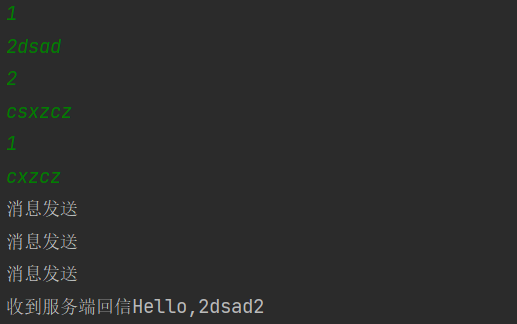
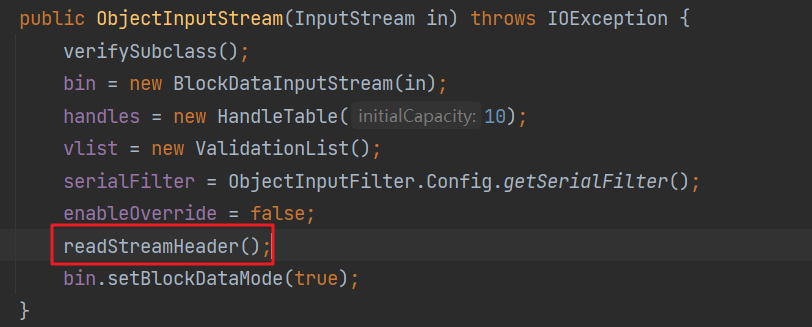
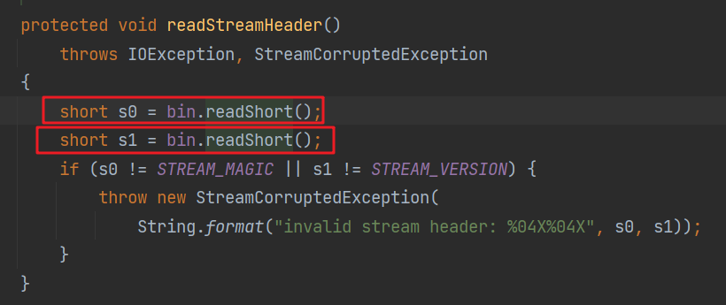
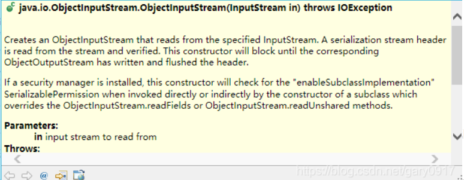

# 手写RPC框架


==**罗曼-罗兰说过的，这个世上只有一种真正的英雄主义，那就是认清生活的真相，并且仍然热爱它。**==


## RPC架构


## 技术选型


### **网络传输：**

**（为了调用远程方法，就是需要发送网络请求来传递目标类和方法信息以及方法的参数到服务提供方）**

- **bio**

- **nio**

- **netty**

### **序列化：**

**（编写网络应用程序的时候，因为数据在网络中传输的都是二进制字节码数据，在发送数据时需要编码，在接收数据时需要解码）**

- **java自带的序列化**（之前使用过 这个的话，不支持跨语言平台 同时性能比较差  序列化后的体积比较大）
- **kyro**
- **protobuf**（尝试使用这个进行）

### 代理：

**（一开始我也不知道代理有什么用，直接把业务逻辑代码写在那边不就行了吗，但是后面听了韩顺平老师的课后发现，动态代理的目的就是让对象能像调用自己方法一样，调用远端的方法，相当于对于服务调用者是一个黑盒的状态）**

- **静态代理**
- **动态代理JDK**
- **动态代理Cglib**

### **注册中心：**

**（服务端启动的时候将服务名+服务地址+服务端口注册 然后客户端进行调用的时候 就通过查到相应服务的地址进行调用--相当于目录）**

- **zookeeper**（试试放在linux的docker里玩下）（用zookeeper和curator分别来实现  注册中心）
  
  - 目的在一台虚拟机中装多个带zookeeper的centos镜像，这样就不用启动过多的虚拟机了。这是后话，目前来说并不需要集群，先都注册到一个zookeeper上
    
  - `zookeeper的安装`，可以直接在linux下安装，我选择在linux的docker下安装，以下是安装步骤（暂时没有用到集群部署所以不对其配置进行修改）
  
    ```shell
    #拉取最新版zookeeper镜像  
    [root@zytCentos ~]# docker pull zookeeper
    Using default tag: latest
    latest: Pulling from library/zookeeper
    1fe172e4850f: Pull complete 
    44d3aa8d0766: Pull complete 
    fda2f211fa11: Pull complete 
    9154e8aefca7: Pull complete 
    692fa00e9b62: Pull complete 
    a17c9a9b7c3c: Pull complete 
    bd7073bfcd08: Pull complete 
    0e2c8094a504: Pull complete 
    Digest: sha256:1e62d091501c7125293c087414fccff4337c08d203b92988f4d88081b4f1f63e
    Status: Downloaded newer image for zookeeper:latest
    docker.io/library/zookeeper:latest
    ```
  
  - `zookeeper的运行`
    保持zookeeper的开启状态，由于我之前启动没有加-d所以在执行连接它的命令时总会自动关闭，加了的目的是保证它能保持后台运行，--restart always这个指令的目的就是之后不用每次都再启动了
  
    ```shell
    [root@zytCentos ~]# docker run -d -p 2181:2181 --name zytzookeeper --restart always zookeeper
    ```
  
  - 尝试用本地idea连接启动的服务端
  
    - 添加依赖 zookeeper原生客户端和一个更加便捷开发的客户端Curator
  
      ```java
              <!--Zookeeper的依赖 客户端-->
              <dependency>
                  <groupId>org.apache.zookeeper</groupId>
                  <artifactId>zookeeper</artifactId>
                  <version>3.5.7</version>
              </dependency>
              <!--顺带引入的更便捷操作的curator的依赖 Curator是Netflix公司开源的一个Zookeeper客户端 简化了原生的开发-->
              <dependency>
                  <groupId>org.apache.curator</groupId>
                  <artifactId>curator-framework</artifactId>
                  <version>4.3.0</version>
              </dependency>
              <dependency>
                  <groupId>org.apache.curator</groupId>
                  <artifactId>curator-recipes</artifactId>
                  <version>4.3.0</version>
              </dependency>
              <dependency>
                  <groupId>org.apache.curator</groupId>
                  <artifactId>curator-client</artifactId>
                  <version>4.3.0</version>
              </dependency>
      ```
  
    - 进行测试开发 是否有效
      首先前提我为了方便起见设置了域名映射（想偷懒的小伙伴可以尝试）
  
      
  
      
  
      `接下来就是尝试去连接了 `
  
      
  
      `创建成功`
  
      
  
      `测试成功` 进行设置
  
      
  
- **nacos**

  - a


### **传输协议：**

**（传输协议的作用 就是我们发送的信息 要按照我们自己的规定构造 相当于密文传输的感觉 让别人不知道在发送什么 ）**

- 

### **负载均衡：**

**（防止访问量过大，可以将请求分到其他服务提供方上，减少宕机、崩溃的风险）**

- 自己代码实现  
- zookeeper本身就能实现软负载均衡吧   可以在zookeeper中记录每台服务器的访问次数，让访问最少的去处理最新的客户端请求

### 其他机制：

- 心跳机制
- 解决粘包、拆包问题
- 注解开发等等


## RPC框架v1.0简易版

`要求简单实现远程调用`

==用最笨的方法实现==

### 技术选型

- 网络传输：nio
- 序列化：java自带序列化

### 客户端

**消费者启动端**

```java
package consumer.bootstrap;

import consumer.nio.NIOClient;

import java.io.IOException;

/*
    以nio为网络编程框架的消费者端启动类
 */
public class NIOConsumerBootStrap {
    public static void main(String[] args) throws IOException {
        NIOClient.start("127.0.0.1",6666);
    }
}

```

**消费者实际业务端**

```java
package consumer.nio;

import java.io.IOException;
import java.net.InetSocketAddress;
import java.nio.ByteBuffer;
import java.nio.channels.SelectionKey;
import java.nio.channels.Selector;
import java.nio.channels.SocketChannel;
import java.nio.charset.StandardCharsets;
import java.util.Iterator;
import java.util.Scanner;

public class NIOClient {
    public static void start(String HostName, int PORT) throws IOException{
        start0(HostName,PORT);
    }

    //真正启动在这
    private static void start0(String hostName, int port) throws IOException {
        //得到一个网络通道
        SocketChannel socketChannel = SocketChannel.open();
        System.out.println("-----------服务消费方启动-------------");
        socketChannel.configureBlocking(false);
        //建立链接  非阻塞连接  但我们是要等他连接上
        if (!socketChannel.connect(new InetSocketAddress(hostName,port))) {
            while (!socketChannel.finishConnect());
        }
        //创建选择器 进行监听读事件
        Selector selector = Selector.open();
        socketChannel.register(selector, SelectionKey.OP_READ, ByteBuffer.allocate(1024));
        //创建匿名线程进行监听读事件
        new Thread(new Runnable() {
            @Override
            public void run() {
                while (true)
                {
                    //捕获异常  监听读事件
                    try {
                        if (selector.select(1000)==0)
                        {
                            continue;
                        }
                        Iterator<SelectionKey> keyIterator = selector.selectedKeys().iterator();
                        while (keyIterator.hasNext())
                        {
                            SelectionKey key = keyIterator.next();
                            ByteBuffer buffer = (ByteBuffer)key.attachment();
                            SocketChannel channel = (SocketChannel)key.channel();
                            int read = 1;
                            //用这个的原因是怕 多线程出现影响
                            StringBuffer stringBuffer = new StringBuffer();
                            while (read!=0)
                            {
                                buffer.clear();
                                read = channel.read(buffer);
                                stringBuffer.append(new String(buffer.array(),0,read));
                            }
                            System.out.println("收到服务端回信"+stringBuffer.toString());
                            keyIterator.remove();
                        }
                    } catch (IOException e) {
                        e.printStackTrace();
                    }
                }
            }
        }).start();

        //真正的业务逻辑  等待键盘上的输入 进行发送信息
        Scanner scanner = new Scanner(System.in);
        while (true)
        {
            int methodNum = scanner.nextInt();
            String message = scanner.next();
            String msg = new String(methodNum+"#"+message);
            socketChannel.write(ByteBuffer.wrap(msg.getBytes(StandardCharsets.UTF_8)));
            System.out.println("消息发送");
        }
    }
}
```


### 服务端

**服务提供者启动端**

```java
package provider.bootstrap;

import provider.nio.NIOServer;

import java.io.IOException;

/*
    以nio为网络编程框架的服务提供端启动类
 */
public class NIOProviderBootStrap {
    public static void main(String[] args) throws IOException {
        NIOServer.start(6666);
    }
}

```

**服务提供者实际业务端**

```java
package provider.nio;

import api.ByeService;
import api.HelloService;
import provider.api.ByeServiceImpl;
import provider.api.HelloServiceImpl;

import java.io.IOException;
import java.net.InetSocketAddress;
import java.nio.ByteBuffer;
import java.nio.channels.*;
import java.nio.charset.StandardCharsets;
import java.util.Iterator;
import java.util.Set;

public class NIOServer {

    //启动
    public static void start(int PORT) throws IOException {
        start0(PORT);
    }

    //TODO 当服务消费方下机时  保持开启状态

    /*
        真正启动的业务逻辑在这
        因为这是简易版 那么先把异常丢出去
     */
    private static void start0(int port) throws IOException {
        //创建对应的服务器端通道
        ServerSocketChannel serverSocketChannel = ServerSocketChannel.open();
        System.out.println("-----------服务提供方启动-------------");
        //开启一个选择器 将自己要
        Selector selector = Selector.open();

        //绑定端口开启
        serverSocketChannel.bind(new InetSocketAddress(port));

        //这里注意 要设置非阻塞   阻塞的话  他会一直等待事件或者是异常抛出的时候才会继续 会浪费cpu
        serverSocketChannel.configureBlocking(false);

        //要先设置非阻塞 再注册  如果时先注册再设置非阻塞会报错
        serverSocketChannel.register(selector, SelectionKey.OP_ACCEPT);

        //真正的业务逻辑 就是下面
        //循环等待客户端的连接和检查事件的发生
        while (true)
        {
            //1秒钟无事发生的话  就继续
            if (selector.select(1000)==0)
            {
                continue;
            }

            //获取所有的对象
            Set<SelectionKey> selectionKeys = selector.selectedKeys();
            Iterator<SelectionKey> keyIterator = selectionKeys.iterator();

            while (keyIterator.hasNext())
            {
                SelectionKey key = keyIterator.next();
                if (key.isAcceptable())
                {
                    SocketChannel socketChannel = serverSocketChannel.accept();
                    System.out.println("连接到消费端"+socketChannel.socket().getRemoteSocketAddress());
                    socketChannel.configureBlocking(false);
                    socketChannel.register(selector,SelectionKey.OP_READ, ByteBuffer.allocate(1024));
                }
                if (key.isReadable())
                {
                    //反向获取管道
                    SocketChannel socketChannel = (SocketChannel)key.channel();
                    //反向获取Buffer
                    ByteBuffer buffer = (ByteBuffer)key.attachment();
                    //进行调用方法并返回
                    //获得信息
                    StringBuffer stringBuffer = new StringBuffer();
                    int read = 1;
                    while (read!=0)
                    {
                        //先清空 防止残留
                        buffer.clear();
                        read = socketChannel.read(buffer);
                        //添加的时候  根据读入的数据进行
                        stringBuffer.append(new String(buffer.array(),0,read));
                    }
                    //方法号和信息中间有个#进行分割
                    String msg = stringBuffer.toString();
                    String[] strings = msg.split("#");
                    String response;
                    if (strings.length<2)
                    {
                        //当出现传入错误的时候 报异常
                        System.out.println("传入错误");
                        throw new RuntimeException();
                    }
                    if (strings[0].equals("1"))
                    {
                        HelloService helloService = new HelloServiceImpl();
                        response = helloService.sayHello(strings[1]);
                    }
                    else if (strings[0].equals("2"))
                    {
                        ByeService byeService = new ByeServiceImpl();
                        response = byeService.sayBye(strings[1]);
                    }
                    else
                    {
                        //当出现传入错误的时候 报异常
                        System.out.println("传入错误");
                        throw new RuntimeException();
                    }
                    String responseMsg = "收到信息" + strings[1] + "来自" + socketChannel.socket().getRemoteSocketAddress();
                    System.out.println(responseMsg);
                    //将调用方法后获得的信息回显
                    ByteBuffer responseBuffer = ByteBuffer.wrap(response.getBytes(StandardCharsets.UTF_8));
                    //写回信息
                    socketChannel.write(responseBuffer);
                }
                keyIterator.remove();
            }
        }
    }
}

```


### 序列化

JDK自带序列化


### 依赖引入

`最外层pom引入依赖`

```xml

<?xml version="1.0" encoding="UTF-8"?>
<project xmlns="http://maven.apache.org/POM/4.0.0"
         xmlns:xsi="http://www.w3.org/2001/XMLSchema-instance"
         xsi:schemaLocation="http://maven.apache.org/POM/4.0.0 http://maven.apache.org/xsd/maven-4.0.0.xsd">
    <modelVersion>4.0.0</modelVersion>

    <groupId>coder.zyt</groupId>
    <artifactId>zeng-rpc-framework</artifactId>
    <packaging>pom</packaging>
    <version>1.0-SNAPSHOT</version>
    <modules>
        <module>zyt-rpc-consumer</module>
        <module>zyt-rpc-provider</module>
        <module>zyt-rpc-api</module>
        <module>zyt-rpc-common</module>
    </modules>

    <properties>
        <maven.compiler.source>8</maven.compiler.source>
        <maven.compiler.target>8</maven.compiler.target>
    </properties>
    <dependencies>
        <!--方便构建类-->
        <dependency>
            <groupId>org.projectlombok</groupId>
            <artifactId>lombok</artifactId>
            <version>1.18.22</version>
        </dependency>
        <!--打印日志信息-->
        <dependency>
            <groupId>log4j</groupId>
            <artifactId>log4j</artifactId>
            <version>1.2.17</version>
        </dependency>
        <dependency>
            <groupId>org.slf4j</groupId>
            <artifactId>slf4j-api</artifactId>
            <version>1.7.25</version>
        </dependency>
        <dependency>
            <groupId>org.slf4j</groupId>
            <artifactId>slf4j-log4j12</artifactId>
            <version>1.7.25</version>
        </dependency>
        <dependency>
            <groupId>org.slf4j</groupId>
            <artifactId>slf4j-simple</artifactId>
            <version>1.7.25</version>
            <scope>test</scope>
        </dependency>
        <!--测试-->
        <dependency>
            <groupId>org.springframework.boot</groupId>
            <artifactId>spring-boot-starter-test</artifactId>
            <version>2.5.1</version>
        </dependency>

    </dependencies>
</project>
```


### 更新（补丁）

#### **v1.1**

==*更新事项*==

- **解决客户端断开连接后 服务器端也会强制下线的问题**

  - 原因：当客户端断开连接后 服务端的select会监听到事件  isReadable()不仅会监听到读事件还会监听到玩家下线的事件。

  - 解决方案：在读事件捕获异常 优雅的关闭管道    下面是代码实现

    ```java
    try{
        //之前的业务逻辑
    }
    catch (IOException e) {                 
        //进行关闭 并继续执行  取消键的注册 还有关闭管道     
        SocketChannel unConnectChannel = (SocketChannel)key.channel();                     System.out.println(((unConnectChannel.socket().getRemoteSocketAddress())+"下线了"));
    	key.cancel();
        unConnectChannel.close();
    } catch (RuntimeException e) {
        e.printStackTrace();
    }
    ```

- **解决传输时 可能出现的沾包拆包问题**

  

  

  - 原因：TCP是一个“流”协议，是没有界限的一串数据，TCP底层并不了解上层业务数据的具体含义，它会根据TCP缓冲区的实际情况进行包的划分，所以在业务上认为，一个完整的包可能会被TCP拆成多个包进行发送，也有可能把多个小的包封装成一个大的数据包发送，这就是所谓的TCP粘包和拆包问题。
- 解决方案：设置一个标识符  读到标识符时暂停   更换自己的消息发送方式 通过channel  现在改成io   
  `非阻塞的网络io读写只能用到read和write`但这个就是只能使用 阻塞的nio了`额外开了一个包`实现    下面是代码实现
- **尝试使用阻塞io解决粘包问题**
  
  ```java
  //新建请求发送类
  package entity;
  
  import lombok.AllArgsConstructor;
  import lombok.Data;
  import lombok.NoArgsConstructor;
  
  //网络传输请求   重点是要实现序列化 否则不能进行io传输
  @Data
  @AllArgsConstructor
  @NoArgsConstructor
  public class RpcRequest implements Serializable{
      //方法编号
  int methodNum;
      //消息体
  String message;
  }
  ```
  
  
  ```java
  //消费者端
  package consumer.nio;
  import entity.RpcRequest;
  import java.io.IOException;
  import java.io.ObjectInputStream;
  import java.io.ObjectOutputStream;
  import java.net.InetSocketAddress;
  import java.nio.channels.SocketChannel;
  import java.util.Scanner;
  //阻塞NIO消费端 解决沾包问题
  public class NIOBlockingClient {
      public static void start(String HostName, int PORT) throws IOException {
          start0(HostName,PORT);
      }
  
      //真正启动在这
      private static void start0(String hostName, int port) throws IOException {
          //得到一个网络通道
          SocketChannel socketChannel = SocketChannel.open();
          System.out.println("-----------服务消费方启动-------------");
          //设置阻塞
          socketChannel.configureBlocking(true);
          //建立链接  阻塞连接  但我们是要等他连接上
         socketChannel.connect(new InetSocketAddress(hostName,port));
  
          //真正的业务逻辑  等待键盘上的输入 进行发送信息
          Scanner scanner = new Scanner(System.in);
  
          //输入输出通道都放在外面
  
          ObjectOutputStream outputStream = new ObjectOutputStream(socketChannel.socket().getOutputStream());
          ObjectInputStream objectInputStream = new ObjectInputStream(socketChannel.socket().getInputStream());
          //都是阻塞等待 发完了 接收完了 才能进行下一步 不然会报异常
          while (true)
          {
              int methodNum = scanner.nextInt();
              String message = scanner.next();
              RpcRequest request = new RpcRequest(methodNum,message);
              //进行修订 使得可以传送对象 通过自带的io流进行 避免出现沾包拆包现象
  
              outputStream.writeObject(request);
              System.out.println("消息发送");
              try {
  
                  String msg = (String)objectInputStream.readObject();
                  System.out.println("收到来自客户端的消息"+msg);
              } catch (ClassNotFoundException e) {
                  e.printStackTrace();
              }
          }
      }
  }
  
  ```
  
  
  ```java
  //NIO非阻塞服务提供方 主要的代码
  
  package provider.nio;
  
  import api.ByeService;
  import api.HelloService;
  import entity.RpcRequest;
  import provider.api.ByeServiceImpl;
  import provider.api.HelloServiceImpl;
  
  import java.io.*;
  import java.net.InetSocketAddress;
  import java.nio.channels.Selector;
  import java.nio.channels.ServerSocketChannel;
  import java.nio.channels.SocketChannel;
  
  //阻塞NIO服务提供端 解决沾包问题
  public class NIOBlockingServer {
      //启动
      public static void start(int PORT) throws IOException {
          start0(PORT);
      }
      //TODO 当服务消费方下机时  保持开启状态
  
  /*
      真正启动的业务逻辑在这
      因为这是简易版 那么先把异常丢出去
   */
  private static void start0(int port) throws IOException {
      //创建对应的服务器端通道
      ServerSocketChannel serverSocketChannel = ServerSocketChannel.open();
      System.out.println("-----------服务提供方启动-------------");
      //开启一个选择器 将自己要
      Selector selector = Selector.open();
  
      //绑定端口开启
      serverSocketChannel.bind(new InetSocketAddress(port));
  
      //设置阻塞
      serverSocketChannel.configureBlocking(true);
  
      //真正的业务逻辑 就是下面
      //循环等待客户端的连接和检查事件的发生
      while (true)
      {
          SocketChannel channel = serverSocketChannel.accept();
          System.out.println("来自"+channel.socket().getRemoteSocketAddress()+"的连接");
          new Thread(new Runnable() {
              @Override
              public void run() {
                  try {
                      //在内部不断的进行监听
                      InputStream inputStream = channel.socket().getInputStream();
                      OutputStream outputStream = channel.socket().getOutputStream();
                      ObjectInputStream objectInputStream = new ObjectInputStream(inputStream);
                      ObjectOutputStream objectOutputStream = new ObjectOutputStream(outputStream);
                      while (true)
                      {
                          String response;
                          RpcRequest request = (RpcRequest)objectInputStream.readObject();
                          if (request.getMethodNum()==1)
                          {
                              HelloService helloService = new HelloServiceImpl();
                              response = helloService.sayHello(request.getMessage());
                          }
                          else if (request.getMethodNum()==2)
                          {
                              ByeService helloService = new ByeServiceImpl();
                              response = helloService.sayBye(request.getMessage());
                          }
                          else
                          {
                              System.out.println("传入错误");
                              throw new RuntimeException();
                          }
                          System.out.println("收到客户端"+channel.socket().getRemoteSocketAddress()+"的消息"+response);
                          objectOutputStream.writeObject(response);
                      }
                  } catch (Exception e) {
                      System.out.println("channel"+channel.socket().getRemoteSocketAddress()+"断开连接");
                      try {
                          channel.close();
                      } catch (IOException ex) {
                          ex.printStackTrace();
                      }
                  }
              }
          }).start();
      }
  }
  }
  ```


#### **v1.2**

==*更新事项*== `以下更新均在非阻塞模块进行更新，阻塞模块可供读者自己尝试`

- **进一步减少用户使用的复杂感  之前分辨方法是通过判断传递的字符串、类型中的方法编号字段来抉择的，这次的话，将更加精简，使用注册中心，==目前每个服务提供者每人只提供一个服务，其他的日后再完善==**

  - 首先我做的是将zookeeper的地址设置为常量这样，之后每次在创建zookeeper连接中地址参数可以直接拿，同时修改起来也方便，把sessionTimeout也设为常量

    ```java
    package constants;
    
    public class RpcConstants {
        //zookeeper服务器连接地址
        public static String ZOOKEEPER_ADDRESS = "zytCentos:2181";
        //超时时间
        public static int ZOOKEEPER_SESSION_TIMEOUT = 2000;
    }
    
    ```

  - 实现服务提供端将对应地址注册到zookeeper中
    

    ```java
    package zkService;
    
    import constants.RpcConstants;
    import org.apache.zookeeper.*;
    import org.apache.zookeeper.data.Stat;
    
    import java.io.IOException;
    import java.nio.charset.StandardCharsets;
    
    
    //该类将对应服务端的方法和相应的端口和地址，注册到zooKeeper中
    public class ZkServiceRegistry {
        private static String connectString = RpcConstants.ZOOKEEPER_ADDRESS;
        private static int sessionTimeout = RpcConstants.ZOOKEEPER_SESSION_TIMEOUT;
        private static ZooKeeper zooKeeper;
    
        static void createConnect() throws IOException {
            zooKeeper = new ZooKeeper(connectString, sessionTimeout, new Watcher() {
                @Override
                public void process(WatchedEvent watchedEvent) {
    
                }
            });
        }
    
        //创建成功后把方法注册进去
        static void register(String RpcServiceName,String hostname,int port) throws InterruptedException, KeeperException {
            //节点名就是方法名  然后对应的数据就是hostname+"："+port
    
    
            //因为这个地区属于一个临界区 可能会发生线程不安全问题 所以进行上🔒
            synchronized (ZkServiceRegistry.class) {
                Stat exists = zooKeeper.exists("/service", null);
                if (exists ==null) {
                    zooKeeper.create("/service",
                            "".getBytes(StandardCharsets.UTF_8),
                            ZooDefs.Ids.OPEN_ACL_UNSAFE,
                            CreateMode.PERSISTENT
                    );
                }
            }
    
            String date = hostname+":"+port;
    
            //权限目前都设置为全放开   创建方式均为持久化
            zooKeeper.create("/service/"+RpcServiceName,
                    date.getBytes(StandardCharsets.UTF_8),
                    ZooDefs.Ids.OPEN_ACL_UNSAFE,
                    CreateMode.PERSISTENT
                    );
        }
    
        /**
         *
         * @param RpcServiceName 这是对应的服务名
         * @param hostname 和可以调用该服务的ip
         * @param port  还有对应的端口号
         * @throws IOException
         * @throws InterruptedException
         */
        public static void registerMethod(String RpcServiceName,String hostname,int port) throws IOException, InterruptedException, KeeperException {
            //先创建对应的额zooKeeper连接客户端再进行相应的注册
            createConnect();
            register(RpcServiceName,hostname,port);
            System.out.println("服务端:"+hostname+":"+port+"方法注册完毕");
    
        }
    }
    
    ```

    ==进行测试==

    `存在问题` 测试出现问题 启动两个服务只有一个服务的方法注册进去了；
    `解决方法` 因为我每个服务提供方到后面都是循环着监听 所以第一个进去了就出不来立刻  开了多个线程

    `存在问题` 就是会重复进行创建service节点  应该是引入了线程安全的问题 就是单例模式懒汉模式1中类似的问题
    `解决方法` 对方法进行加锁 使用了synchronized锁，该锁jdk1.6之后进行了优化可以使用！

    `成功解决`

    

  - 服务提供方启动代码如下（遇到了线程安全问题 之后尝试如何进一步优化）

    ```java
    /*
        以nio为网络编程框架的服务提供端启动类  加入了zk  遇到了线程安全问题 成功解决了
     */
    public class NIOProviderBootStrap12 {
        public static void main(String[] args) throws IOException, InterruptedException, KeeperException {
            //启动
            new Thread(new Runnable() {
                @Override
                public void run() {
                    //因为每个服务提供端内部都是在监听循环阻塞 每个开启一个线程进行监听
                    try {
                        NIONonBlockingServer12hello.start(6666);
                    } catch (IOException e) {
                        e.printStackTrace();
                    } catch (InterruptedException e) {
                        e.printStackTrace();
                    } catch (KeeperException e) {
                        e.printStackTrace();
                    }
                }
            }).start();
    
            //启动
            new Thread(new Runnable() {
                @Override
                public void run() {
                    try {
                        NIONonBlockingServer12bye.start(6667);
                    } catch (IOException e) {
                        e.printStackTrace();
                    } catch (InterruptedException e) {
                        e.printStackTrace();
                    } catch (KeeperException e) {
                        e.printStackTrace();
                    }
                }
            }).start();
        }
    }
    
    ```

    

  - 实现消费者端获取所需服务对应的地址

    ```java
    //通过方法名 反过来获取服务对应的地址
    public class ZkServiceDiscovery {
        private static String connectString = RpcConstants.ZOOKEEPER_ADDRESS;
        private static int sessionTimeout = RpcConstants.ZOOKEEPER_SESSION_TIMEOUT;
        private static ZooKeeper zooKeeper;
    
        //第一步当然是连接到远端服务器上了
        public static void getConnect() throws IOException {
            zooKeeper = new ZooKeeper(connectString, sessionTimeout, new Watcher() {
                @Override
                public void process(WatchedEvent watchedEvent) {
    
                }
            });
        }
    
        // 根据所请求的服务地址 获取对应的远端地址
        public static String getMethodAddress(String methodName) throws RpcException, InterruptedException, KeeperException {
    
            //判断节点中是否存在对应路径  不存在则抛出异常
            if (zooKeeper.exists("/service/"+methodName,null)==null)
            {
                System.out.println("不存在该方法");
                throw new RpcException();
            }
    
            //到对应节点中获取地址   stat节点状态信息变量
            byte[] data = zooKeeper.getData("/service/" + methodName, false,null);
            String address = new String(data);
            return address;
        }
    
        public static void getStart(String methodName) throws IOException, RpcException, InterruptedException, KeeperException {
            //先进行连接
            getConnect();
            //获取相应的远端地址
            String methodAddress = getMethodAddress(methodName);
            //进行连接
            String[] strings = methodAddress.split(":");
            //启动
            String address = strings[0];
            int port = Integer.valueOf(strings[1]);
            NIONonBlockingClient12.start(address,port);
        }
    }
    ```

    

    

- **用代理模式 让用户感觉在调用本地方法一样，调用远端方法。**

  - 前面的改动尚不能实现，需要加上现在下面这一部分，代理模式，才能更好的实现用户的远端调用

  - 设计被代理用户类

    ```java
    //这是之后要被代理的对象 我们会实现它的方法
    public interface Customer {
        String sayBye(String saying);
        String sayHello(String saying);
    }
    ```

  - 设计代理类 //实现了调用后回传的功能  像本身调用一样

    ```java
    package consumer.proxy;
    
    import consumer.zkService.ZkServiceDiscovery;
    
    
    import java.lang.reflect.InvocationHandler;
    import java.lang.reflect.Method;
    import java.lang.reflect.Proxy;
    
    //代理类的实现
    public class RpcClientProxy {
    
        //获取代理对象 并返回 当前类别
        public static Object getBean(final Class<?> serviceClass){
            /*
                参数详解
                1、用哪个类加载器去加载对象
                2、动态代理类需要实现的接口 class[]{xxxx.class} 得到的就是对应的类别
                3、动态代理类执行方法的时候需要干的事
             */
            return Proxy.newProxyInstance(Thread.currentThread().getContextClassLoader(),
                    new Class[]{serviceClass},
                    new InvocationHandler() {
                        @Override
                        public Object invoke(Object proxy, Method method, Object[] args) throws Throwable {
                            //暂时还没有设置回信这个操作
                            String methodName = method.getName();
                            String response = ZkServiceDiscovery.getStart(methodName, (String) args[0]);
                            return response;
                        }
                    }
            );
        }
    }
    ```

  - 修改了消费者端的方法，和之前的功能不一样了，之前是属于在控制台输入 持续的回复，这次改为一次调用得到回复，像调用自己的方法一样

    ```java
    package consumer.nio;
    
    import java.io.IOException;
    import java.net.InetSocketAddress;
    import java.nio.ByteBuffer;
    import java.nio.channels.SelectionKey;
    import java.nio.channels.Selector;
    import java.nio.channels.SocketChannel;
    import java.nio.charset.StandardCharsets;
    import java.util.Iterator;
    
    
    //v1.2版本非阻塞nio   真正意义上实现了rpc调用
    public class NIONonBlockingClient12 {
        public static String start(String HostName, int PORT,String msg) throws IOException{
            return start0(HostName,PORT,msg);
        }
    
        //真正启动在这
        private static String start0(String hostName, int port,String msg) throws IOException {
            //得到一个网络通道
            SocketChannel socketChannel = SocketChannel.open();
            System.out.println("-----------服务消费方启动-------------");
            socketChannel.configureBlocking(false);
            //建立链接  非阻塞连接  但我们是要等他连接上
            if (!socketChannel.connect(new InetSocketAddress(hostName,port))) {
                while (!socketChannel.finishConnect());
            }
            //创建选择器 进行监听读事件
            Selector selector = Selector.open();
            socketChannel.register(selector, SelectionKey.OP_READ, ByteBuffer.allocate(1024));
    
            //进行发送 发的太快了 来不及收到
            socketChannel.write(ByteBuffer.wrap(msg.getBytes(StandardCharsets.UTF_8)));
    
            //直接进行监听
            while (true)
            {
                //捕获异常  监听读事件
                try {
                    if (selector.select(1000)==0)
                    {
                        continue;
                    }
                    Iterator<SelectionKey> keyIterator = selector.selectedKeys().iterator();
                    while (keyIterator.hasNext())
                    {
                        SelectionKey key = keyIterator.next();
                        ByteBuffer buffer = (ByteBuffer)key.attachment();
                        SocketChannel channel = (SocketChannel)key.channel();
                        int read = 1;
                        //用这个的原因是怕 多线程出现影响
                        StringBuffer stringBuffer = new StringBuffer();
                        while (read!=0)
                        {
                            buffer.clear();
                            read = channel.read(buffer);
                            stringBuffer.append(new String(buffer.array(),0,read));
                        }
                        return stringBuffer.toString();
                    }
                } catch (IOException e) {
                    e.printStackTrace();
                }
            }
        }
    }
    
    ```

  - 启动类代码

    ```java
    package consumer.bootstrap;
    
    
    import consumer.proxy.RpcClientProxy;
    import method.Customer;
    
    
    import java.io.IOException;
    
    /*
        以nio为网络编程框架的消费者端启动类
     */
    public class NIOConsumerBootStrap12 {
        public static void main(String[] args) throws IOException {
    
            RpcClientProxy clientProxy = new RpcClientProxy();
            Customer customer = (Customer) clientProxy.getBean(Customer.class);
            String response = customer.hello("success");
            System.out.println(response);
            System.out.println(customer.bye("fail"));
        }
    }
    ```

    

  - **实现效果**

    

    


## RPC框架v2.0netty版


## 遇到的问题

- @Data注解在类上无法使用   `解决`我把我一些没导版本号的依赖加上版本后恢复
  
- 额外开启一个线程进行监听读事件  第一次可以监听的到 后面就监听不到了     `解决`迭代器iterator一定要记得remove否则就出错了
  
- 当关闭一个客户端的时候  服务端也自动关闭了  `解决` 更新v1.1
  
- 当利用io对request对象进行传输时出现 Exception in thread "main" java.nio.channels.IllegalBlockingModeException     `原因`  假如socker是非阻塞的话  可以用selector   但不能用io流 因为这是阻塞传输方式。
  
- 还遇到了做阻塞启动的时候，我获取了一个通道的输入流和输出流 然后出问题了直接死锁动弹不得 因为一个管道是半双工的 所以不能同时输入流输出流进行读写  我现在尝试去修改。 `修改成功`  我把输入流和输出流的创建顺序和他们的使用顺序保持 一致就成功了？  ==继续查找原因==  [(8条消息) ObjectInputStream与ObjectOutputStream的顺序问题_到中流遏飞舟的博客-CSDN博客](https://blog.csdn.net/qq_38746380/article/details/102993169)查看该网址 ，说的非常详细！ 如果两边创建的都是先ObjectInputStream会导致都阻塞在那边等待读写 

  - 不多说直接追源码

    





​		第一段的意思是，创建一个从指定的InputStream读取的ObjectInputStream，序列化的流的头是从这个Stream中读取并验证的。此构造方法会一直阻塞直到相应的ObjectOutputStream已经写入并刷新头。

所以上述代码执行后会都阻塞，如果将创建ObjectInputStream的顺序修改成其他的顺序，便可正常通信。


- zookeeper各个端口的作用：

  2181：对客户端提供服务
  2888：Follower与Leader交换信息的端口。 
  3888：万一集群中的Leader服务器挂了，需要一个端口来重新进行选举，选出一个新的Leader，而这个端口就是用来执行选举时服务器相互通信的端口。

- 在设置与linux中zookeeper连接的时候  当我创建临时节点，通过服务器查询第一下查到了，然后马上查不到了，尝试解决。`解决`是我之前学的没有记牢 ，因为一旦客户端断开连接的话，那么临时节点也会断开连接 所以创建持久节点。
  
- zookeeper创建必须是它父节点要存在才能进行创建
  
- Zookeeper ZooDefs.Ids

  **OPEN_ACL_UNSAFE**  **:** 完全开放的ACL，任何连接的客户端都可以操作该属性znode

  **CREATOR_ALL_ACL :** 只有创建者才有ACL权限

  **READ_ACL_UNSAFE：**只能读取ACL

- 当创建zk连接的时候 产生了空指针异常  是因为没有添加监听器
  
- 在设置多个线程同时启动时，共同注册到zk中，遇到了多线程问题 
  `存在问题` 测试出现问题 启动两个服务只有一个服务的方法注册进去了；
  `解决方法` 因为我每个服务提供方到后面都是循环着监听 所以第一个进去了就出不来立刻  开了多个线程

  `存在问题` 就是会重复进行创建service节点  应该是引入了线程安全的问题 就是单例模式懒汉模式1中类似的问题
  `解决方法` 对方法进行加锁 使用了synchronized锁，该锁jdk1.6之后进行了优化可以使用！

  `成功解决`

- 获取动态代理对象的三个参数详解

  

- github不能同时上传太多的文件！重要

  
  

## 总结

跳过了BIO的方式直接进行了NIO的简易RPC的设计，比较简单，还有很多需要进行实现的东西。当然在搭轮子的途中我遇到了很多的坑，一点点的填，我自身也有了很大的长进，关于网络编程，关于io...未完待续...


