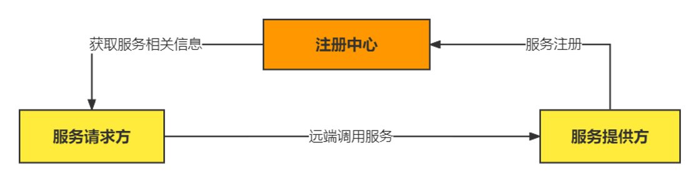

# 手写RPC框架

==**罗曼-罗兰说过的，这个世上只有一种真正的英雄主义，那就是认清生活的真相，并且仍然热爱它。**==

## RPC架构

## 技术选型

### **网络传输：**

**（为了调用远程方法，就是需要发送网络请求来传递目标类和方法信息以及方法的参数到服务提供方）**

- bio

- nio

- netty

### **序列化：**

**（编写网络应用程序的时候，因为数据在网络中传输的都是二进制字节码数据，在发送数据时需要编码，在接收数据时需要解码）**

- java自带的序列化（之前使用过 这个的话，不支持跨语言平台 同时性能比较差  序列化后的体积比较大）
- kyro
- protobuf（尝试使用这个进行）

### 代理：

**（一开始我也不知道代理有什么用，直接把业务逻辑代码写在那边不就行了吗，但是后面听了韩顺平老师的课后发现，动态代理的目的就是让对象能像调用自己方法一样，调用远端的方法，相当于对于服务调用者是一个黑盒的状态）**

- 静态代理
- 动态代理JDK
- 动态代理Cglib

### **注册中心：**

**（服务端启动的时候将服务名+服务地址+服务端口注册 然后客户端进行调用的时候 就通过查到相应服务的地址进行调用--相当于目录）**

- zookeeper
- nacos

### **传输协议：**

**（传输协议的作用 就是我们发送的信息 要按照我们自己的规定构造 相当于密文传输的感觉 让别人不知道在发送什么 ）**

- 

### **负载均衡：**

**（防止访问量过大，可以将请求分到其他服务提供方上，减少宕机、崩溃的风险）**

- 自己代码实现

## 代码实现

### 服务端

### 客户端

### 注册中心

